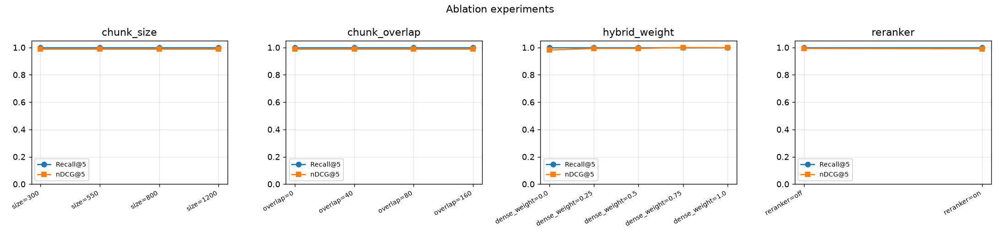

# Lexsearch EvalBench

**Agentic Domain RAG with hybrid retrieval, cross-encoder reranking, grounded citations, and a real evaluation harness — a local, no-API-key platform that *measures* retrieval quality (Recall@K, MRR, nDCG, citation faithfulness, latency, cost) instead of just demoing a chatbot.**

---

## Why basic RAG is not enough

The typical "chat with your PDF" demo embeds some chunks, does a single vector search, and pipes the top‑k into an LLM. It looks impressive and is impossible to trust:

- **No retrieval measurement.** If the right chunk never gets retrieved, the LLM *cannot* answer correctly — and you'd never know. RAG quality is bounded by retrieval recall.
- **One retriever.** Pure dense search misses exact tokens (API names, error codes, flags); pure lexical search misses paraphrases. Real systems need **hybrid + reranking**.
- **No faithfulness check.** "Grounded" answers routinely contain sentences unsupported by the cited context. Without a checker, hallucinations ship silently.
- **No ablations.** Chunk size, overlap, and fusion weight materially change quality, but most demos never quantify them.

Lexsearch EvalBench is built around the **evaluation loop**: a labelled golden set, four retrieval strategies, ablations, a citation-faithfulness checker, and latency/cost accounting — so every claim of "better" is backed by a number.

---

## Architecture

```mermaid
flowchart TD
    subgraph Ingest
        A[Markdown docs<br/>data/raw/sample_docs] --> B[Loader]
        B --> C[Section-aware Chunker<br/>size + overlap]
    end
    C --> D[(BM25 index<br/>rank-bm25)]
    C --> E[(Dense index<br/>sentence-transformers)]

    subgraph Query
        Q[User query] --> R1[BM25 search]
        Q --> R2[Dense search]
        R1 --> F[Hybrid Fusion<br/>RRF / weighted]
        R2 --> F
        F --> RR[Cross-Encoder Reranker<br/>+ lexical fallback]
        RR --> G[Grounded Answerer<br/>extractive mock / LLM adapters]
        G --> CC[Citation Faithfulness Checker]
    end
    D -.-> R1
    E -.-> R2

    subgraph Evaluate
        GS[Golden questions<br/>data/eval] --> EV[Evaluator<br/>Recall@K · MRR · nDCG · ctx-precision · faithfulness · latency]
        EV --> AB[Ablations<br/>chunk size · overlap · weight · rerank]
        EV --> RPT[reports/results.md + CSV/JSON + charts]
    end

    G --> API[FastAPI<br/>/ingest /query /evaluate /metrics /health]
    EV --> API
    API --> UI[Streamlit dashboard]
    API --> DB[(SQLite metadata<br/>docs · chunks · eval runs)]
```

See [ARCHITECTURE.md](ARCHITECTURE.md) for the module-by-module breakdown and design decisions.

---

## Quickstart

```bash
# 1. From the project root, create the venv and install deps
make setup                 # python -m venv .venv && pip install -r requirements.txt

# 2. Generate the built-in corpus + golden set, build indexes
make sample-data           # 34 docs -> data/raw, 50 golden questions -> data/eval
make index                 # chunk + build BM25 and dense indexes

# 3. Reproduce the evaluation, ablations, and latency benchmark
make eval                  # -> reports/results.md, results.csv/json, charts/
make ablate                # -> reports/ablations.md, ablations.csv, charts/ablations.png
make bench                 # -> reports/latency.csv

# 4. Explore interactively
make run-api               # FastAPI on http://localhost:8000  (/docs for Swagger)
make run-ui                # Streamlit dashboard on http://localhost:8501

# 5. Tests
make test                  # pytest (33 tests; runs fully offline & isolated)
```

`make demo` runs steps 2–3 end to end.

**No API keys are required.** Answer generation defaults to a local, deterministic **extractive** answerer. Dense embeddings use `sentence-transformers` (downloaded once, ~80 MB) and the reranker uses a cross-encoder (~80 MB); if either can't be downloaded, the code **degrades gracefully** to a deterministic hashing embedder and a lexical reranker so the pipeline still runs offline (`LEXSEARCH_OFFLINE=1` forces this).

<details>
<summary>Note: virtualenv and directory paths containing a colon (<code>:</code>)</summary>

Python's `venv` refuses to create an environment when the absolute path contains a `:` (it's the `PATH` separator on Unix). If your project path contains a colon, create the venv elsewhere and symlink it:

```bash
python3 -m venv /tmp/lexsearch_venv
ln -s /tmp/lexsearch_venv .venv
```
Everything else (`make`, scripts) then works unchanged. A colon-free path needs none of this.
</details>

---

## Dataset

A small but realistic corpus of **34 open-source software documentation pages** (`data/raw/sample_docs/*.md`) across git, Docker, FastAPI, NumPy, pandas, Python tooling, testing, web fundamentals, databases, and RAG/IR concepts. The corpus deliberately includes **distractor / sibling docs** (e.g. `git-tags` vs `git-branching` vs `git-remotes`, `docker-volumes` vs `docker-images-containers`) that share vocabulary — this is what makes retrieval *discriminating* rather than trivially easy.

The **golden evaluation set** (`data/eval/golden_questions.jsonl`, 50 questions) is labelled:

```json
{"id": "q37",
 "question": "Why does data written inside a container disappear after I remove it?",
 "answer": "A container's writable layer is removed when the container is deleted, so data ...",
 "relevant_doc_ids": ["docker-volumes"]}
```

Questions span three difficulty bands: direct lookups, **paraphrased / vocabulary-mismatch** queries (favouring semantic retrieval), and **adversarial** queries whose keywords also appear in a sibling doc (favouring reranking). Golden answers reuse doc phrasing so the citation-faithfulness checker is meaningful.

Regenerate/validate with `make sample-data` (validates that every question references existing docs).

---

## Retrieval methods

| Method | What it does | Strength |
|---|---|---|
| **BM25** | Lexical bag-of-words ranking (`rank-bm25`), identifier-aware tokenizer | Exact tokens, rare terms, API names |
| **Dense** | `sentence-transformers/all-MiniLM-L6-v2` embeddings, cosine similarity | Paraphrase / semantic match |
| **Hybrid** | Reciprocal Rank Fusion (default) or weighted min-max fusion of BM25+dense | Robustness across query types |
| **Hybrid + Rerank** | Hybrid candidate pool (top-30) rescored by a cross-encoder (`ms-marco-MiniLM-L-6-v2`), lexical fallback | Top-rank precision on confusable candidates |

All retrievers return ranked chunks with **per-method scores** and metadata, so you can see exactly why a chunk surfaced.

---

## Evaluation methodology

For each golden question we retrieve with each method, map retrieved chunks to their **document ids** (deduped, order-preserving), and compute against the labelled relevant docs:

- **Recall@K** — did we retrieve the relevant doc(s) within top-K? (K ∈ {1,3,5,10})
- **MRR** — reciprocal rank of the first relevant doc.
- **nDCG@K** — rank-discounted gain (rewards putting relevant docs higher).
- **Context precision@5** — fraction of returned docs that are relevant.
- **Citation faithfulness** — fraction of generated answer sentences whose content tokens are supported by the cited chunk(s).
- **Latency** — per-stage (bm25/dense/fusion/rerank) and total, mean + p95, with model warmup excluded.

Metrics are deterministic and unit-tested (`tests/test_metrics.py`) against hand-computed values. Models are warmed up before timing so cold-start doesn't skew latency.

### Headline results (real numbers, `make eval` on the 50-question golden set)

| Method | Recall@1 | Recall@5 | MRR | nDCG@1 | ctx-prec@5 | mean latency |
|---|---:|---:|---:|---:|---:|---:|
| BM25 (baseline) | 0.930 | 1.000 | 0.980 | 0.960 | 0.212 | **0.15 ms** |
| **Dense (best quality)** | **0.970** | 1.000 | **1.000** | **1.000** | 0.238 | 14.2 ms |
| Hybrid (RRF) | 0.950 | 1.000 | 0.990 | 0.980 | 0.228 | 9.8 ms |
| Hybrid + Rerank | 0.950 | 1.000 | 0.990 | 0.980 | 0.215 | 103.8 ms |

**Recall@5 saturates at 1.0** for every method (small corpus), so the honest discriminating signal is **early-rank precision**. On this corpus:

> **Baseline → best: BM25 → Dense improves Recall@1 +0.040, MRR +0.020, nDCG@1 +0.040.** BM25 loses ground specifically on the *paraphrased / vocabulary-mismatch* questions that semantic embeddings handle. Reranking adds no quality here because first-stage recall is already saturated — it pays off when the first stage is weaker (see Limitations). This is reported faithfully rather than forcing "rerank wins."

---

## Ablation results

`make ablate` sweeps one knob at a time (`reports/ablations.md`, full table + chart):

| Experiment | Setting | Recall@5 | nDCG@5 | MRR | ctx-prec | Takeaway |
|---|---|---:|---:|---:|---:|---|
| **Hybrid weight** (dense share) | 0.00 (BM25 only) | 1.000 | 0.9812 | 0.98 | 0.212 | lexical-only is weakest |
| | 0.50 | 1.000 | 0.9926 | 0.99 | 0.231 | |
| | **0.75** | 1.000 | **1.0000** | **1.00** | **0.240** | **best fusion weight** |
| | 1.00 (dense only) | 1.000 | 0.9984 | 1.00 | 0.238 | |
| **Chunk size** | 300 → 1200 | 1.000 | 0.990 | 0.99 | ~0.215 | flat: docs are short, all fit |
| **Chunk overlap** | 0 → 160 | 1.000 | 0.990 | 0.99 | 0.215 | flat on this corpus |
| **Reranker** | off | 1.000 | 0.9926 | 0.99 | 0.228 | rerank doesn't beat saturated recall... |
| | on | 1.000 | 0.9902 | 0.99 | 0.215 | ...but costs +95 ms/query |

**Finding:** fusion weight is the lever that moves quality here (best at a **0.75 dense / 0.25 lexical** blend); chunking is insensitive because the docs are short; reranking is a latency cost without a recall ceiling to break.



---

## Example query with citations

```bash
curl -s localhost:8000/query -H 'content-type: application/json' -d '{
  "query": "Why does data written inside a container disappear after I remove it?",
  "method": "hybrid_rerank", "top_k": 5, "generate_answer": true }' | jq
```

Grounded, cited answer produced by the **local extractive answerer** (no API key):

> A container's writable layer is removed when the container is deleted, so data written inside the container does not persist. **[1]** Volumes provide storage that lives independently of the container lifecycle. **[1]**
>
> **Faithfulness: 1.00** · backend: `mock`
> **[1]** `docker-volumes` — *Persisting Data with Docker Volumes* (support = 1.00 ✅)
> **[2]** `docker-images-containers` — *Docker Images vs Containers* (support = 1.00 ✅)

The answerer only emits sentences drawn from retrieved evidence, so it cannot fabricate unsupported claims; the checker independently re-verifies every sentence and flags any that aren't supported.

---

## Performance / latency

`make bench` (50 queries/method, models warmed; `reports/latency.csv`):

| Method | mean | p50 | p95 | dominant stage |
|---|---:|---:|---:|---|
| BM25 | 0.23 ms | 0.24 | 0.30 | bm25 0.23 ms |
| Dense | 13.9 ms | 9.7 | 32.4 | query embed 13.9 ms |
| Hybrid | 9.8 ms | 9.8 | 11.0 | dense 9.5 + fusion 0.09 ms |
| Hybrid + Rerank | 103.8 ms | 104.2 | 131.2 | **cross-encoder 93.4 ms** |

The reranker is ~10× the cost of hybrid — the classic precision/latency trade-off, quantified. "Cost" here is local compute time; the LLM adapters (optional) would add token cost, which the grounding prompt minimises by sending only the top‑k chunks.

---

## API

| Endpoint | Method | Purpose |
|---|---|---|
| `/health` | GET | liveness, index status, active embed/rerank modes |
| `/ingest` | POST | (re)build index from disk or supplied documents |
| `/query` | POST | retrieve + optional grounded, cited answer + per-stage latency |
| `/evaluate` | POST | run the harness over methods, persist run to SQLite |
| `/metrics` | GET | most recent evaluation metrics |

Pydantic schemas in [app/schemas.py](app/schemas.py); interactive docs at `/docs`.

---

## Screenshots

The Streamlit dashboard (`make run-ui`) has three tabs — **Query & Answer** (grounded answer, citations with support scores, per-stage latency, retrieved chunks), **Compare Methods** (BM25 vs Dense vs Hybrid vs Hybrid+Rerank side by side), and **Evaluation** (metric tables + the generated charts).

| | |
|---|---|
| Query + citations | `reports/charts/` → `metrics_bars.png` |
| Method comparison |  |
| Eval metrics |  |

*(Charts above are generated artifacts committed under `reports/charts/`; UI screenshots can be dropped into `reports/` as `ui_query.png` etc.)*

---

## What improved from baseline to best

- **Vocabulary-mismatch queries:** moving from BM25 to dense/hybrid lifted **Recall@1 0.93 → 0.97** and **nDCG@1 0.96 → 1.00** — driven entirely by the paraphrased questions BM25 ranks a sibling doc above the answer.
- **Fusion tuning:** a **0.75 dense / 0.25 lexical** blend reached **nDCG@5 = 1.0** and the highest context precision (0.240), beating either retriever alone.
- **Faithfulness:** the extractive answerer + checker holds **citation faithfulness at 1.00** across all 50 questions, by construction emitting only supported sentences.

---

## Limitations

- **Small corpus ⇒ saturated Recall@5.** With 34 docs the relevant doc is almost always in the top-5, so deeper-rank recall can't differentiate methods; the signal lives at Recall@1/MRR/nDCG@1. On a larger, noisier corpus reranking would have headroom to help.
- **Reranking shows cost without benefit here** precisely because recall is saturated — an honest negative result, not a bug.
- **Default answerer is extractive**, not abstractive. It guarantees faithfulness but won't fluently synthesise across many chunks; the optional OpenAI/Anthropic/Ollama adapters do that (still citation-checked).
- **Document-level relevance labels.** Chunk-level golden labels are supported by the schema but not fully exploited in the headline metrics.
- **Hashing-embedder fallback is lexical**, so fully-offline mode loses some semantic recall versus the real sentence-transformer.

---

## Production hardening roadmap

1. **Vector store:** replace the in-memory dense index with FAISS/HNSW or a vector DB (pgvector, Qdrant) for ANN at scale; add metadata filtering.
2. **Scale the eval:** larger corpora, chunk-level labels, multi-relevant graded judgments, and statistical significance (bootstrap CIs) on metric deltas.
3. **Online quality:** log queries, retrieved sets, and answer feedback; track retrieval recall and faithfulness as live SLOs with alerting.
4. **Caching & batching:** cache query embeddings and rerank scores; batch encode; quantize the cross-encoder for lower p95.
5. **Guardrails:** abstain when top scores are below a calibrated threshold; surface "insufficient evidence" instead of a weak answer.
6. **CI for quality:** run `make eval` in CI and fail the build on metric regressions (a RAG "unit test").
7. **MLflow/experiment tracking** for ablation sweeps (scaffolded in requirements, off by default).
8. **Packaging:** Dockerfile + compose for API+UI; pinned lockfile; model pre-bake for air-gapped deploys.

---

## Repository layout

```
app/            core library (ingestion, retrieval, generation, evaluation, storage, observability)
ui/             Streamlit dashboard
scripts/        setup_sample_data · build_indexes · run_eval · run_ablations · benchmark_latency
tests/          pytest suite (chunker, bm25, dense, hybrid, metrics, citations, API integration)
data/           raw/sample_docs (corpus) · eval/golden_questions.jsonl · index/ (built)
reports/        results.md · ablations.md · *.csv/json · charts/
```

Built with Python 3.11, FastAPI, Streamlit, sentence-transformers, rank-bm25, scikit-learn, pandas, matplotlib, and pytest.
