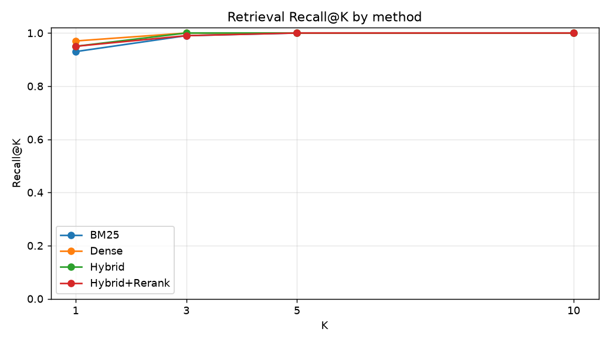
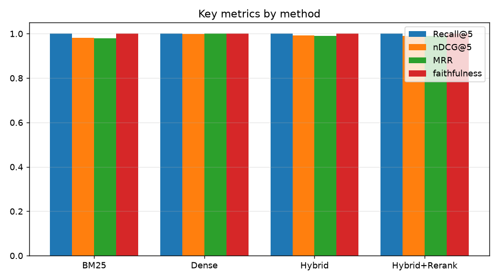
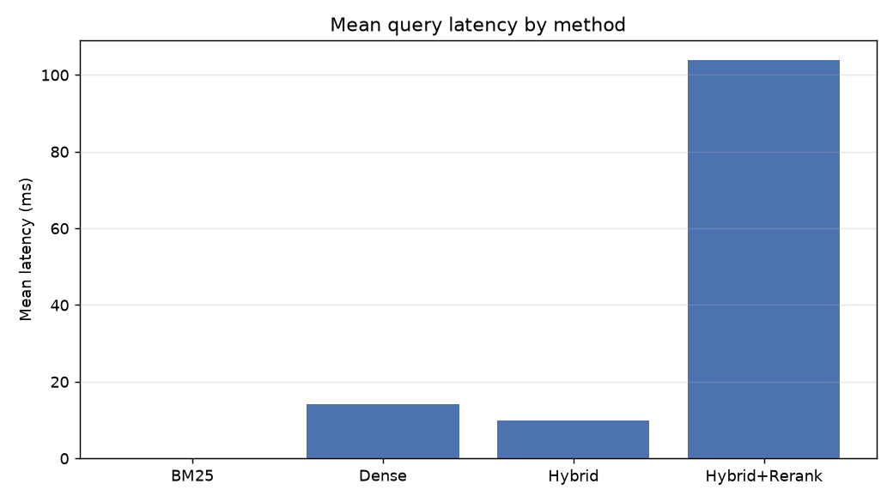

# Lexsearch EvalBench — Evaluation Results

- Questions evaluated: **50**
- Corpus chunks: **103**
- Dense mode: **sentence-transformers** (sentence-transformers/all-MiniLM-L6-v2)
- Rerank mode: **cross-encoder**
- Fusion: **rrf**

## Aggregate metrics by method

| method        |   MRR |   ctx_precision@5 |   faithfulness |   latency_ms(mean) |   latency_ms(p95) |   Recall@1 |   Recall@3 |   Recall@5 |   Recall@10 |   nDCG@1 |   nDCG@3 |   nDCG@5 |   nDCG@10 |
|:--------------|------:|------------------:|---------------:|-------------------:|------------------:|-----------:|-----------:|-----------:|------------:|---------:|---------:|---------:|----------:|
| BM25          |  0.98 |             0.212 |              1 |              0.152 |             0.206 |       0.93 |       0.99 |          1 |           1 |     0.96 |   0.9759 |   0.9812 |    0.9812 |
| Dense         |  1    |             0.238 |              1 |             14.212 |            32.627 |       0.97 |       1    |          1 |           1 |     1    |   0.9984 |   0.9984 |    0.9984 |
| Hybrid        |  0.99 |             0.228 |              1 |              9.817 |            11.021 |       0.95 |       1    |          1 |           1 |     0.98 |   0.9926 |   0.9926 |    0.9926 |
| Hybrid+Rerank |  0.99 |             0.215 |              1 |            103.8   |           133.779 |       0.95 |       0.99 |          1 |           1 |     0.98 |   0.9849 |   0.9902 |    0.9902 |

## Baseline → Best

- Baseline (**BM25**): Recall@1 = **0.930**, MRR = **0.980**, nDCG@1 = **0.960**
- Best (**Dense**): Recall@1 = **0.970**, MRR = **1.000**, nDCG@1 = **1.000**
- **Improvement: Recall@1 +0.040, MRR +0.020, nDCG@1 +0.040**
- Recall@5 saturates at 1.0 for every method on this small corpus, so the discriminating signal is early-rank precision (Recall@1 / MRR / nDCG@1): BM25 loses ground on paraphrased, vocabulary-mismatch questions that semantic retrieval handles.

## Ranking-error examples (best method, first relevant not at rank 1)

- None — the best method ranked a relevant doc first for every question. 🎉

## Charts

